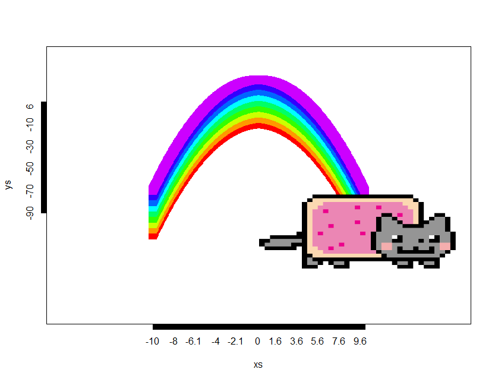
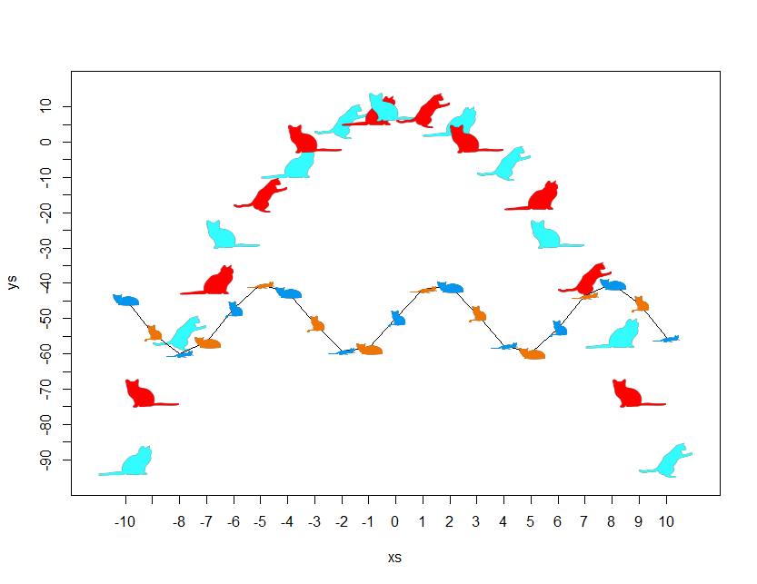
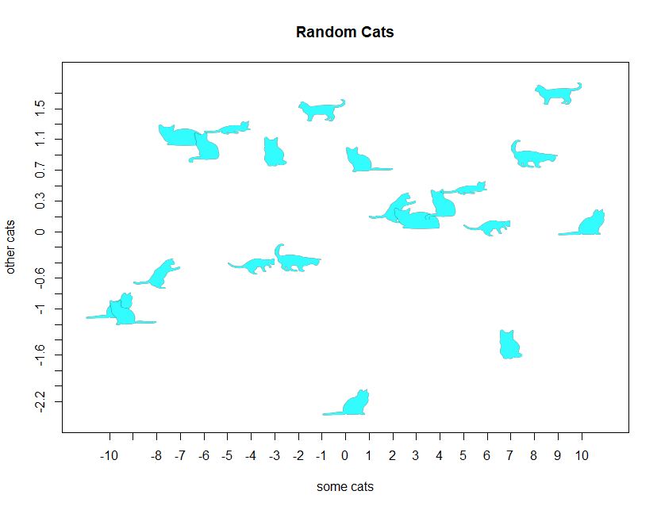
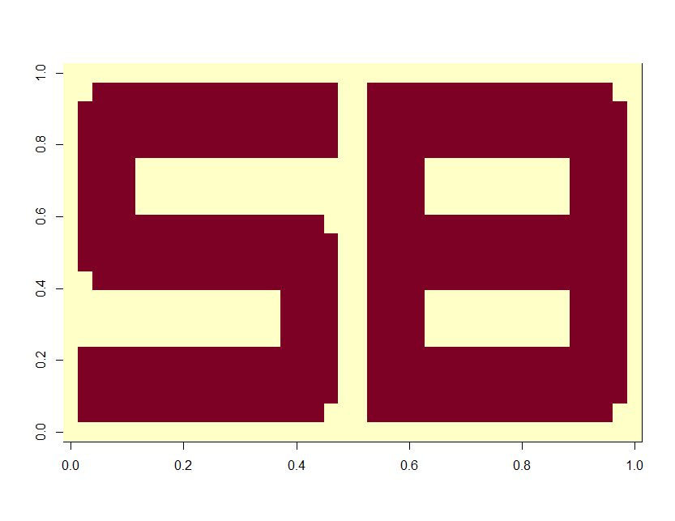
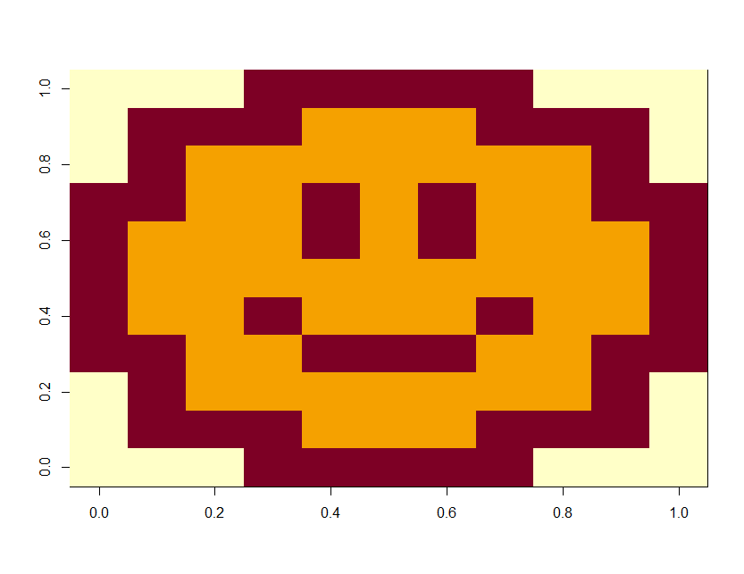

## Test yourself SOLUTIONS 
1. Install these packages (and their dependencies): 
   +  From CRAN: [tidyverse](https://www.tidyverse.org/), [devtools](https://cran.r-project.org/web/packages/devtools/index.html)
   +  From bioconductor: [EGAD](https://bioconductor.org/packages/release/bioc/html/EGAD.html)
   +  From github: [CatterPlots](https://github.com/Gibbsdavidl/CatterPlots)

2. In your console, generate a vector of random numbers (any which way you want) of length between 10 and 100, and assign it to a variable called "my_random_numbers". Print out the length of this vector, and then the first and last numbers of the vector. Copy the code into your R notebook as an R chunk.  

```{r }
my_random_numbers = sample(100, sample(10:100, 1))
length(my_random_numbers)
my_random_numbers[1]
tail(my_random_numbers, n=1)
```

3. Generate two square matrices (equal width and height) named B1 and B2. Multiply these matrices and save the output of the multiplication as B. Print out the first column of B1, the last row of B2, and then the diagonal of B. Copy the code into your R notebook as an R chunk. 
```
B1 = matrix( sample(100), nrow=10, ncol=10)
B2 = matrix( sample(100), nrow=10, ncol=10)
B = B1 %*% B2
print(B1[,1])
print(B2[10,])
print(diag(B))
```

4. Plot any of the plots from the CatterPlot page. Copy the code into your R notebook as an R chunk. 

```{r }
#library(devtools)
#install_github("Gibbsdavidl/CatterPlots")
library(CatterPlots)

x <- -10:10
y <- -x^2 + 10
rainbowCats(x, y, yspread=0.05, xspread=0.05, ptsize=2, catshiftx=0.5, catshifty=-0.2, canvas=c(-0.5,1.5,-1,1.5))
```


```{r }
purr <- catplot(xs=x, ys=y, cat=3, catcolor='#000000FF')
cats(purr, -x, -y, cat=4, catcolor='#FF0000')
```


```{r }
# for more fun ...
meow <- multicat(xs=x, ys=y, cat=c(1,2,3), catcolor=list('#33FCFF','#FF0000'), canvas=c(-0.1,1.1, -0.1, 1.1))
morecats(meow, x, 10*sin(x)+40, size=0.05, cat=c(4,5,6), catcolor=list('#0495EE','#EE7504'), type="line")
```
 

```{r }
# random cats
meow <- multicat(xs=x, ys=rnorm(21),
                 cat=c(1,2,3,4,5,6,7,8,9,10),
                 catcolor=list('#33FCFF'),
                 canvas=c(-0.1,1.1, -0.1, 1.1),
                 xlab="some cats", ylab="other cats", main="Random Cats")
```


5. Make a matrix of dimension 20 by 40, full of zeroes. Then, modify the matrix so that once viewed, it spells out your initials OR a random shape OR pixel art. Use the [image()](https://www.rdocumentation.org/packages/graphics/versions/3.5.1/topics/image) function to view it as you go along, but remember, it plots things [rotated](https://www.r-bloggers.com/creating-an-image-of-a-matrix-in-r-using-image/)... Once done, plot it using the image function, but remove the axes. Copy the code into your R notebook as an R chunk. 

```{r }
## S B example 
matA = matrix(0, ncol=40, nrow=20)
matA[2:5,2:39]   = 3
matA[9:12,2:39]  = 3
matA[16:19,2:39] = 3
 
matA[3:4,2:39]   = 3
matA[10:11,2:39] = 3
matA[17:18,2:39] = 3

matA[3:19,2:5]   = 3
matA[2:19,16:19] = 3
matA[2:19,22:25] = 3
matA[2:19,36:39] = 3
 

matA[,20:21] = 0
matA[6:8,2:5] = 0
matA[13:15,16:19] = 0

matA[19,39] = 0
matA[19,2] = 0
matA[2,39] = 0
matA[2,19] = 0
matA[12,19] = 0
matA[9,2] = 0

image(t(matA))
```



```{r }
## Smiley face
circle <- function(r) { x = (-100:100)/100; y = sqrt(r^2 - x^2  ); return(rbind(cbind(x,y), cbind(x,-y) )) }
 
matB = matrix(1, ncol=11, nrow=11)
tt = (circle(1))
tt = (tt + 1)
tt2 = (round(tt/2,1)  * 10  ) + 1 
matB[tt2] = 2 
matB[c(7:8),5] = 2 
matB[c(7:8),7] = 2 
matB[4,5:7] = 2 
matB[5,c(4,8)] = 2 

matB[c(1:3,9:11),c(1,11)] = 0
matB[c(1,11),c(1:3,9:11)] = 0

image(t(matB))
```




6. "Knit" your R markdown file into a pdf or html. 
 
