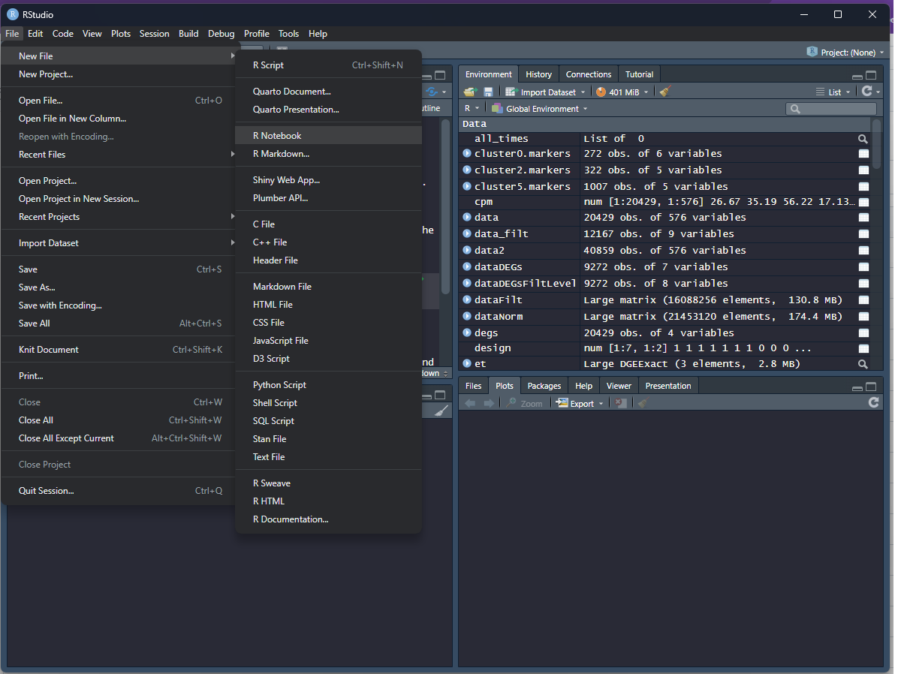
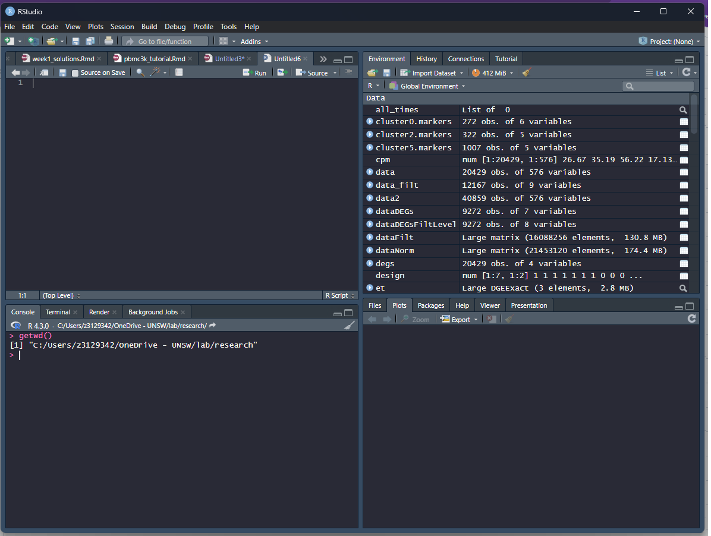

# Week 1: Intro and setting up
Hi! Welcome to the BINF2010 tutorial stream. 

## Overall tutoRial aims 
- Introduce you to R :large_blue_circle: and Python :snake:
- Basic concepts in data analysis
- "Cool" visuals 

## CouRse outline
1. Week 1: [Intro](intro.md)
2. Week 2: Introduction to Python[](lesson6.md)
3. Week 3: Data Viz[](lesson7.md)
4. Week 4: Snakes on a plane[](lesson8.md)
5. Week 5: R basics[](lesson2.md)
6. Week 6: BReak! 
7. Week 7: Data Viz in R[](lesson3.md)
8. Week 8: A fun example[](lesson4.md)
9. Week 9: So shiny
10. Week 10: Recap[](lesson9.md)

## What is R? 
- Statistical and graphical language
- Follower of [S](https://en.wikipedia.org/wiki/S_(programming_language))

### What is it good foR?  
- Data mining/analysis 
- Data visualization and graphics
- Statistics! 
- Glorified calculator? 

### Packages, Repositories, oh my!
- Packages are code (and other!) bundles.
- Packages are accessed through the `library()` or `require()` functions. 
- Repositories are where packages are located. Most are in [CRAN](https://cran.r-project.org/web/packages/). [Bioconductor](https://www.bioconductor.org/packages/release/BiocViews.html) and also [github](https://github.com/trending/r). 
- More on this [here](http://r-pkgs.had.co.nz/) and [here](https://www.datacamp.com/community/tutorials/r-packages-guide). 

## What is Python?
- Initially developed during the late 1980’s by Guido van Rossum. First development version released in 1991. Version 1 released in 1994.
Python 2.0.0 released June, 2001 and Python 2.x end-of-life Jan 1, 2020.
This version was so popular and widely used that many Bioinformatics programs were written using it. Some of these tools have been converted to support v3.x, others are in the process of being upgraded or have been abandoned and will stay on v2.x. The last Python 2.x release is still available for download.
Python 3.x (December 2008) was a significant re-design and broke compatibility with some parts of v2.x.

### What isssssssss it good for?  
- Data mining/analysis
- Machine learning

### Modules 
- Modules are code bundles. 
- Modules are accessed by using the import statement. When you do this, you execute the code of the module, keeping the scopes of the definitions so that your current file(s) can make use of these.
- You can download modules through `pip` (package installer for Python). 


## How do I...
### Install R
Start off by downloading [R](https://cran.r-project.org/) and then [RStudio](https://www.rstudio.com/).
- [Installing R for Windows](installwindows.md)
- [Installing R for Mac](installmac.md)
- [Installing R for Unix](installunix.md)

#### Install packages
From CRAN: 
``` 
install.packages("gplots")
```
From Bioconductor: 
``` 
if (!require("BiocManager"))
    install.packages("BiocManager")
BiocManager::install("limma")
```
From github:
```  
install.packages("devtools")
library(devtools)
devtools::install_github("karthik/wesanderson")
```
#### Load libraries 
```
library(gplots)
library(limma)
library(wesanderson)
```

### Install Python

Start off by downloading [VSCode](https://code.visualstudio.com/) and then [Python](https://www.python.org/downloads/).
- [Installing python for Windows](installwindows.md#installing-python)
- [Installing python for Mac](installmac.md#installing-python)
- [Installing python for Unix](installunix.md#installing-python)

#### Install modules
``` 
pip install matplotlib
pip install biopython
```
#### Import modules
```
import matplotlib
```

## Testing your installation - R 
Make sure you have installed Rstudio and R correctly. 

Open up Rstudio.


You should be able to see 4 different windows. We will be working within the "Source" and "Console" windows. 

Start a new notebook file by selecting "File" -> "New File" -> "R Notebook" 



This should open up a file in the source window. Change the title to "Week 1", and include your name as the author by including this line underneath the title:


```
title: "Week 1" 
author: "Sara"
```
Save the file as "yourname_week1.Rmd". Delete the instructions starting from "This is an [R...". Insert any notes or comments below in the notebook. Code can be saved as R chunks. An R chunk is code placed after a line that starts with ` ```{r} `and ends before a line with ` ``` `.  

In the console window below the source window, check your working directory by typing in:
```
getwd()
```


To set your working directory, where <home> is your directory, and project is a directory for your tutorials: 
```
setwd("C:/<home>/project")
```
Run the code from [earlier](#install-packages) to install/load libraries. Then, save this [helper](/../data/helper.R) script in your working directory.

Then run this bit of code in your console. Note, it might take a little while, but hopefully it will run smoothly. 
```
source("helper.R") 
```


## Testing your installation - Python 
Make sure you have installed VSCode and Python correctly. 


## WheRe to get help
- [Rstudio](https://www.rstudio.com/)
- [R-Bloggers](https://www.r-bloggers.com/)
- [Stat Methods](https://www.statmethods.net/index.html)

## OtheR useful stuff 
- [Plotly](https://plot.ly/r/)
- [Shiny](https://shiny.rstudio.com/)
- [RMarkdown](https://rmarkdown.rstudio.com/)
- [Cheatsheets](https://www.rstudio.com/resources/cheatsheets/) 
- [Swirl](http://swirlstats.com/)
- [Tidyverse](https://www.tidyverse.org/)
- [R tutorials](https://www.listendata.com/p/r-programming-tutorials.html)
- [Genomics classes](http://genomicsclass.github.io/book/)
- [RLang](https://twitter.com/@RLangTip)
- [Data viz](http://serialmentor.com/dataviz/)
- [Advanced R](https://adv-r.hadley.nz/)
- [50 Practical data sci stats](https://peerj.com/collections/50-practicaldatascistats/)
- [CSAMA](http://www-huber.embl.de/csama2018/#home)
- [Composing-reproducible-manuscripts-using-r-markdown](https://elifesciences.org/labs/cad57bcf/composing-reproducible-manuscripts-using-r-markdown)


And that's it for this week! 

Back to the [homepage](../README.md)
