# Week 3: Data vizualisation and exploratory analysis 
## Objectives 
Some visual things you can do with R and ways to explore your data systematically.
In the tutorial you will:
- Learn about flow control, loops, and vectorised 
- Learn strategies for exploring and finding patterns data
- Different types of plots to explore data


## Downloads 
Once more, download these files into your working directory: 

- [data](../data/lesson2.Rdata). 
- [helper.R](../data/helper.R)

To check your working directory:
```
getwd()
```
To set your working diretory: 
```
setwd("X:/project")
```
Run this to install/load libraries
```
source("helper.R") 
```
## Setting up
Start a new notebook file by selecting "File" -> "New File" -> "R Notebook" 
Save the file as "yourname_week3.Rmd". Delete the instructions starting from "This is an [R...". For the different code below, insert it as R chunks. An R chunk is code placed  after a line that starts with ` ```{ r } `and ends before a line with ` ``` `.  
As before, copy the code chunks into your R notebook as R chunks. 

## Flow control
- Way to program different paths for the program to take
- Come in the form of `if`, `else if`, and `else` statements, which allow you to execute code based on if a condition is met
```
if(condition)
{
    do_this
}
```

- Extend the conditions with `else if` and `else` statements
```
if(condition1)
{
    do_this
}
else if (condition2)
{
   do_that
}
else
{
    do_that_other_thing
}
```

- can have as many `else if` statements as you wish following an `if`
- 
```
i = 2 
if( i > 0 )
{
    print("Positive!")
} 
else if( i < 0 )
{
    print("Negative!")
}
else {
    print("Zero!")
}
```

- can also only have a sole `if` statement 
```
ID = "Sara"
if( ID == "Sara" )
{
    print("Positive!")
}
```
- additionally, there is the ifelse() function that combines an if else statement into a single expression 
```
ifelse(i>0, "Positive!", "Negative!")
```

## Loops and apply functions 
- Loops, like in most other languages, run while certain conditions are met (while loop) 
```
while (test_expression)
{
  do_this
}
```
- example: 
```
i = 10 
while (i > 0)
{
    i = i - 1
    print(i)
}
```
- or for a certain set of objects, terms, range (for). 
```
for (i in objects)
{
  do_this
}
```
- example: 
```
for (i in 1:10)
{
    print(i)
}
```


-  A similar but more efficient set of functions are the apply functions.
-  Main function of the apply group: apply().
-  It takes a data.frame, a matrix, or a multi-dimensional array as input and, depending on the input object type and the function passed in, outputs a vector, a list, a matrix, or an array.
-  MARGIN -> 1 for rows, 2 for columns, and c(1,2) for both! 
```
apply(X, MARGIN, FUN)
```
- example, using it to sum across rows of a matrix
```
mat = matrix(sample(100), nrow=10, ncol=10 )
apply(mat, 1, sum)
```
- example
```
mat = matrix(sample(100), nrow=10, ncol=10 )
apply(mat, c(1,2), sum)
```

- Other functions include lapply(), sapply() and tapply()

```
lapply(1:10, function(i) rep(10, i)) 
sapply(1:10, function(i) rep(i^2, 10))

x = sample(10, size = 100, replace=T)
y = rep( c("X","Y"), 50 )
tapply(x,y, sum)
```


## Visuals
- R is pretty good for visualization
- We will start off with the famous [Iris](http://stat.ethz.ch/R-manual/R-devel/library/datasets/html/iris.html) dataset. You can read more about it [here](https://en.wikipedia.org/wiki/Iris_flower_data_set).   
``` 
summary(iris)
class(iris)
colnames(iris)
```

- the iris dataset is a dataframe, and the columns are labelled 
- first, we can be a little uncouth, and plot everything 
``` 
plot(iris)
```


- The pairs function works in a similar way, and plots a matrix of scatterplots We can specify only to show the lower panel:
```
pairs(iris, upper.panel = NULL )
```


- Now that we've seen all the bits of the data, we can play with visualizing parts of it differently  
- Let's start with a scatter plot of the sepal length versus the petal length
``` 
plot(iris$Sepal.Length, iris$Petal.Length, pch=19, col=as.numeric(iris$Species) )
```

- let's play around with this

``` 
plot(iris$Sepal.Length, iris$Petal.Length, pch=12, cex=3, lwd=4, lty=4, type="b", col=colors()[sample(600,5)][as.numeric(iris$Species)] )
```


```
## Plotting smoothed version
plot(lowess(iris$Sepal.Length, iris$Petal.Length), pch=19)
```


```
## Plotting using the forumla method 
plot(Petal.Length ~ Sepal.Length, data=iris, pch=19, col=Species)
```


- We can view sepal width by species distributions with a boxplot, beanplot, or violinplot: 

``` 
boxplot(iris$Sepal.Width~ iris$Species, col=1:3 )
```

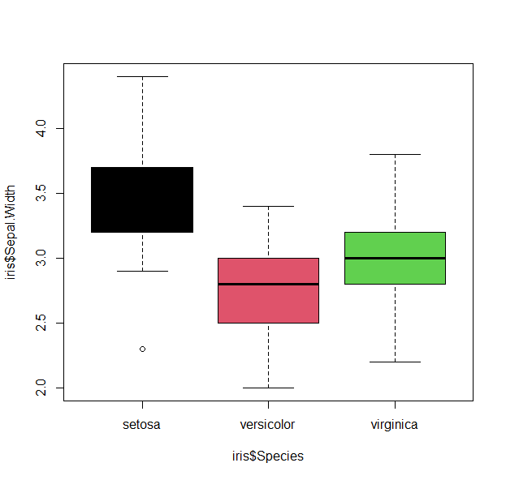


```
beanplot(iris$Sepal.Width~ iris$Species, col=list(1,2,3))
```


```
iris.list = lapply( unique(iris$Species), function(si) iris$Sepal.Width[iris$Species==si]) 
vioplot( iris.list[[1]], iris.list[[2]], iris.list[[3]], col="darkgreen")
```
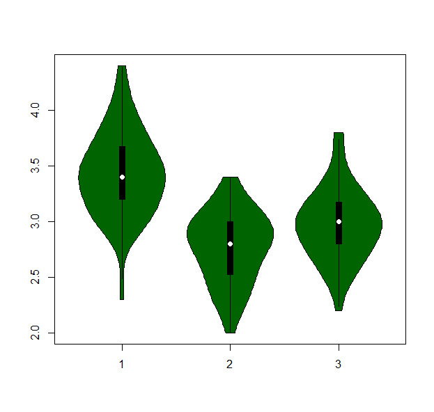

- or build a barplot :
``` 
iris.bar = tapply( iris$Sepal.Length, iris$Species, mean)
barplot(iris.bar, col="black", xlab="Species", ylab="Count", main="Bar plot of mean Sepal Length")
```


- or take a look at the distribution of petal width

``` 
hist(iris$Petal.Width, col="lightblue")
```


- We see biomodality (two modes/peaks) in the petal width data 
- And there is a clear division (<0.75)
- Let us take a look to see what is distinct about the first peak 
- Since we want petal widths less than 0.75, we can slice the data:

``` 
tapply(iris$Petal.Width < 0.75, iris$Species, sum)
```

- That was easy enough, and we can show this again by coloring the histogram based on the species
- Plots in R work by layering, so we can start by drawing the whole histogram first
```

hist(iris$Petal.Width, col="lightblue")

```
- And then adding each individual species as a layer  
```
hist(iris$Petal.Width[iris$Species=="setosa"], col="red", add=T)
hist(iris$Petal.Width[iris$Species=="versicolor"], col="blue", add=T)
hist(iris$Petal.Width[iris$Species=="virginica"], col="purple", add=T)
```
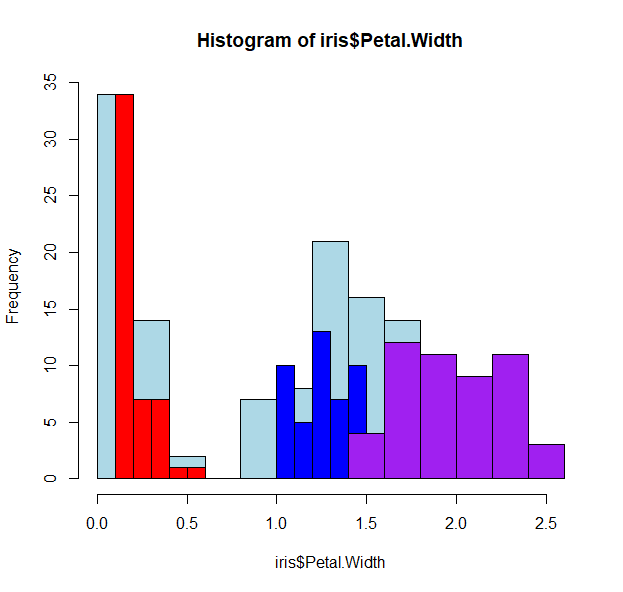

- Oops! The histograms are all wonky because we've not specified how to bin the data. R works "intuitively", and picks the best breaks for that data.  
- We can force similar histogram breaks so that we can bin the data equally

```
h <- hist(iris$Petal.Width, col="lightblue")
h
```
- The h variable has the histogram output
- It has useful tags that we can use such as h$counts, h$mids and most importantly, h$breaks.   

```
hist(iris$Petal.Width[iris$Species=="setosa"],  breaks=h$breaks,col="red", add=T)
hist(iris$Petal.Width[iris$Species=="versicolor"], breaks=h$breaks, col="blue", add=T)
hist(iris$Petal.Width[iris$Species=="virginica"],  breaks=h$breaks,col="purple", add=T)
```
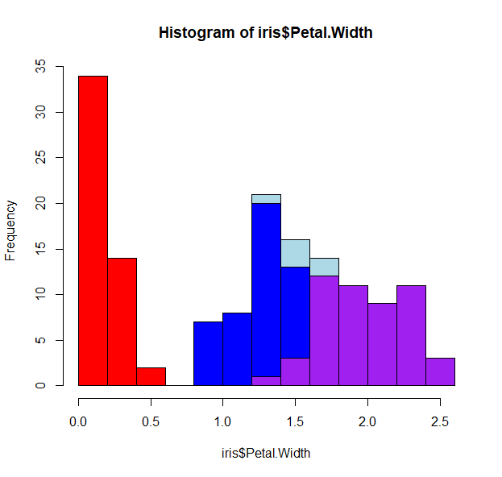

- There is still some overlap, so we can play with the opacity of the colors, and force no color for the first histogram

```
h <- hist(iris$Petal.Width, col=0, border=0)
hist(iris$Petal.Width[iris$Species=="setosa"],  breaks=h$breaks,col=makeTransparent("red"), add=T)
hist(iris$Petal.Width[iris$Species=="versicolor"], breaks=h$breaks, col=makeTransparent("blue"), add=T)
hist(iris$Petal.Width[iris$Species=="virginica"],  breaks=h$breaks,col=makeTransparent("purple"), add=T)

```
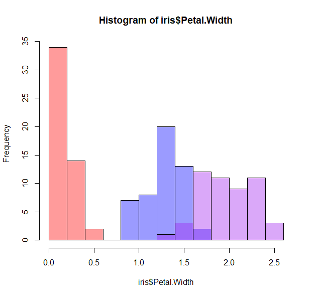
- How about some density lines? 

```
h <- hist(iris$Petal.Width, freq=F)
d_all <-density( iris$Petal.Width) 
lines(d_all, col="black")
```


- We can keep adding layers to our plots with other functions:

```
points()
polygon()
segments()
abline()
rug()
text()
mtext()
legend()
...
```
- More fun things to play with too 
```
pch
type
lty
lwd
bty
... 
```
- Going back to the matrix scatterplot, let's have a visual that summarizes all the data
```
## Ignore these functions (for now) 
panel.hist <- function(x, ...)
{
    usr <- par("usr"); on.exit(par(usr))
    par(usr = c(usr[1:2], 0, 1.5) )
    h <- hist(x, plot = FALSE)
    breaks <- h$breaks; nB <- length(breaks)
    y <- h$counts; y <- y/max(y)
    rect(breaks[-nB], 0, breaks[-1], y, col = "lightgreen", ...)
}
## with size proportional to the correlations.
panel.cor <- function(x, y, digits = 2, prefix = "", cex.cor, ...)
{
    usr <- par("usr"); on.exit(par(usr))
    par(usr = c(0, 1, 0, 1))
    r <- abs(cor(x, y))
    txt <- format(c(r, 0.123456789), digits = digits)[1]
    txt <- paste0(prefix, txt)
    if(missing(cex.cor)) cex.cor <- 0.8/strwidth(txt)
    text(0.5, 0.5, txt, cex = cex.cor * r, col= plasma(100)[round(r,2)*100])
}
```

```
pairs(iris, bg=1:3,lower.panel = panel.smooth, pch=19, upper.panel = panel.cor, diag.panel = panel.hist, cex.labels = 2, font.labels = 2)
```

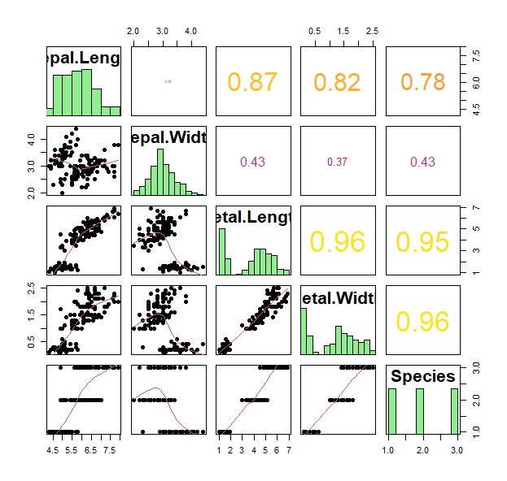

- Great. What if we want to ask how similar are these individual plants to each other within each species. What can we look at?
- Heatmaps and clustering!
```
iris2  = apply(iris[,1:4], 2, as.numeric)
heatmap.3(iris2, RowSideCol=cols7[as.numeric(iris$Species)] , col=viridis(100))
```


```
iris.r  = t(apply(iris[,1:4], 1, rank))
heatmap.3(iris.r, RowSideCol=cols7[as.numeric(iris$Species)] , col=viridis(100))
```


```
iris.r2  = apply(iris[,1:4], 2, rank)
heatmap.3(iris.r2, RowSideCol=cols7[as.numeric(iris$Species)] , col=viridis(100))
```
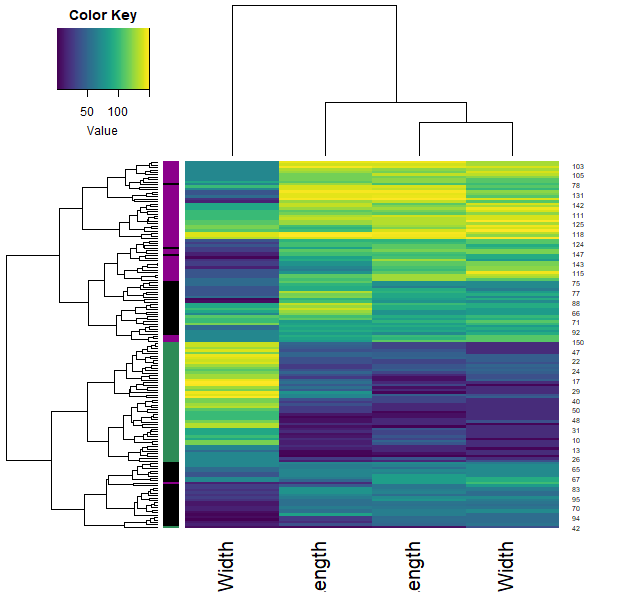

- We can also calculate how similar each sample is through the correlation function (across all their features). Plotting this allows us to visualise these similarities (color) and clustering them allows us to group the samples.
- Note that each iris species clusters together (with very little mixing).  
```
samples.cor = cor( t(iris2) )
heatmap.3(samples.cor, col=plasma(100), ColSideCol=cols7[as.numeric(iris$Species)])
```
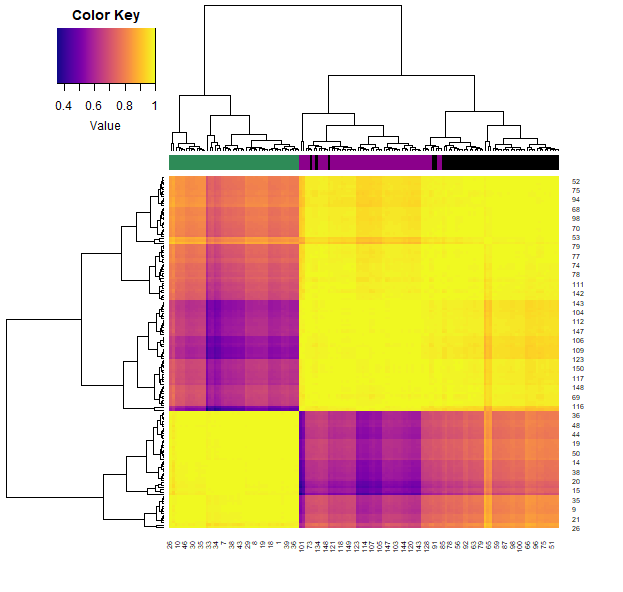


## "Tidyr" versions 
We can do most all of this with [ggplot2](https://github.com/rstudio/cheatsheets/blob/master/data-visualization-2.1.pdf).There are less things finicky things to worry about, and is generally more intuitive. 
```
g <- ggplot(iris, aes(x = Sepal.Length, y = Petal.Length)) 
g
```
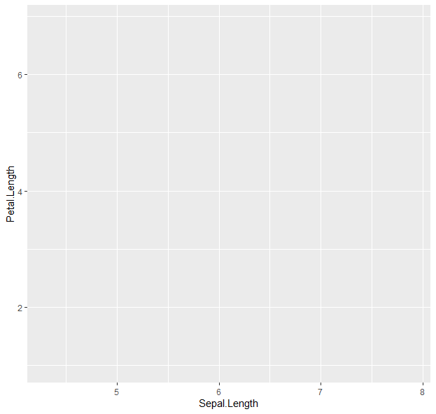

- This does nothing, because we've not specified what we want to draw:
```
g <- g + geom_point()
g
```

- Points! Now to color them:
```
g <- g + geom_point(aes(color = Species))
g
```

- We can keep building onto the "g" variable. 
```
g <- ggplot(iris, aes(x = Sepal.Length, y = Petal.Length, color = Species)) + geom_point()  +  geom_smooth(method = "lm", se = F) 
g
```
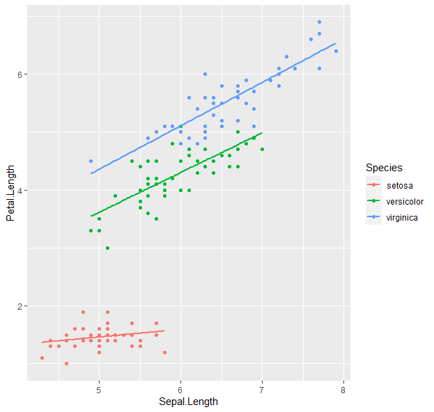
- How about boxplots? 
```
g <- ggplot(data=iris, aes(x=Species, y=Sepal.Length))
g + geom_boxplot(aes(fill=Species)) + 
  ylab("Sepal Length") + ggtitle("Iris Boxplot")  
```

- Histograms:
```
g <- ggplot(data=iris, aes(x=Petal.Width))
g + geom_histogram(binwidth=0.2, color="black", aes(fill=Species)) +  xlab("Petal Width") +  ylab("Frequency") + ggtitle("Histogram of Petal Width") 
```
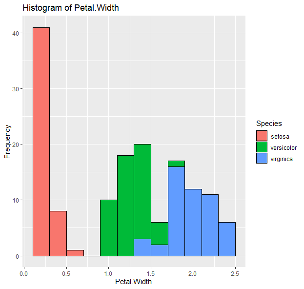
- Barplots:
```
g <- ggplot(data=iris, aes(x=Species, y=Sepal.Length))
g + geom_bar(stat = "summary", fun = "mean") + xlab("Species") +  ylab("Mean") + ggtitle("Bar plot of mean Sepal Length") 
```

More [here](https://www.mailman.columbia.edu/sites/default/files/media/fdawg_ggplot2.html)

## Colors and palettes 
```
colors() 
palette()
```
- Preset colors as strings or as numbers 
- Or based on their RGB 
- e.g.,
```
blacks = c("black", 1, "#000000") 
reds = c("red", 2, "#FF0000") 
allreds = colors()[grep("red", colors())]
```
- Color ramps 
 ```
allredsRamp <- colorRampPalette(allreds)
allredsRamp(100)
grey2blue = colorpanel(100, "lightgrey", "blue", "darkblue")
```
- Predefined palettes:
- default R:
```
rainbow(5)
heat.colors(10)
terrain.colors(100)
topo.colors(10)
cm.colors(5)
```
- R color brewer
```
library(RColorBrewer)
display.brewer.all()
brewer.pal(8, "Set3" ) 
```
- favorites are the viridis palettes (color-blind friendly)
```
library(viridis)
n=10
magma(n)
plasma(n)
inferno(n)
viridis(n)
cividis(n)
turbo(n)
plot(1:n, col=magma(n), pch=19, cex=5)
plot(1:n, col=plasma(n), pch=19, cex=5)
n=100
plot(1:n, col=turbo(n), pch=19, cex=5)
```

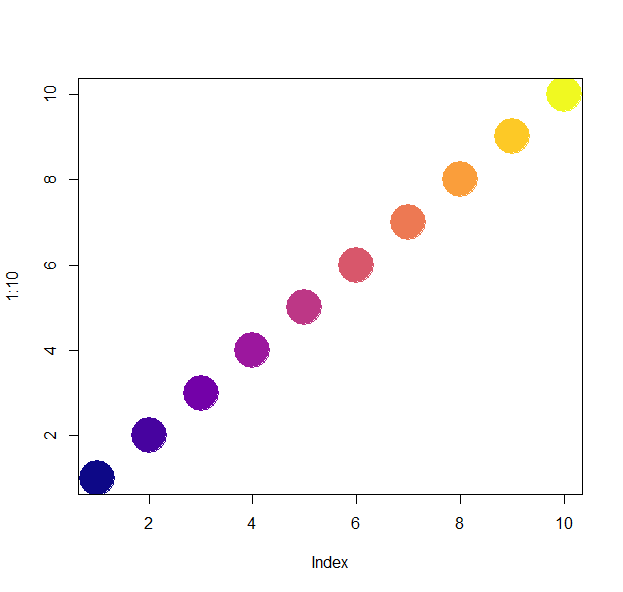


## Test yourself! 
1. Load the file "lesson2.Rdata" into your environment.
2. Plot three plots from the dataset "X" to answer the next set of questions. There are multiple columns in the dataset, so feel free to explore and play around first.
    a. What are the average weights per sex? Show as a histogram.
    b. What are the range of scute numbers per set? Show as a boxplot.
    c. What are the correlations between the biometrics? Show as a correlation plot. 
3. Now, using the dataset "Y", plot a heatmap. Aim for clarity! 
4. And finally, look at dataset "Z". Plot it the best way you think would show its key feature. 
5. "Knit" your R markdown file into an html page or a pdf.  
 
Solutions: Next week!


 ## Resources  
- https://www.nceas.ucsb.edu/~frazier/RSpatialGuides/colorPaletteCheatsheet.pdf
- https://cran.r-project.org/web/packages/viridis/vignettes/intro-to-viridis.html
- https://moderndata.plot.ly/create-colorful-graphs-in-r-with-rcolorbrewer-and-plotly/


Back to the [homepage](../README.md)
