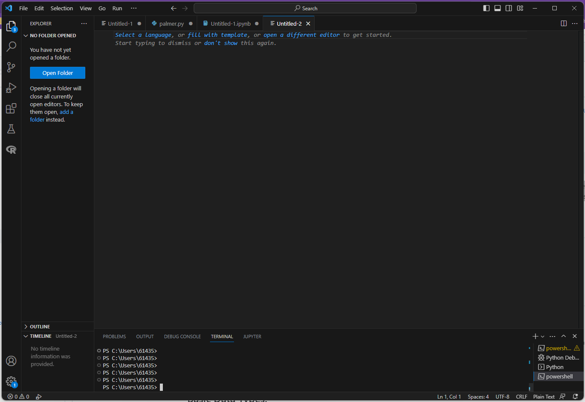
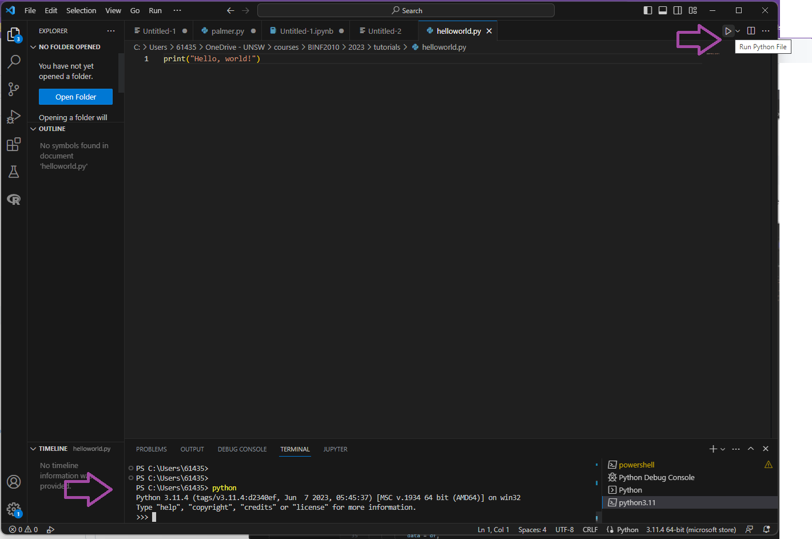

# Week 2: Python basics
Taken/adapted from: https://ucdavis-bioinformatics-training.github.io/2022-Feb-Introduction-To-Python-For-Bioinformatics/python/python2
## Objectives 
- Introduce you to as many concepts in python as possible.
- Python's basic data and data structures  

## Setting up 
Make sure you have VSCode and python installed. 

Open a new file in VSCode.  


Copy and paste (or type) this into your new file:
```
print("Hello, World!")
```
Save the file and name it “helloworld.py”. Note the “.py” extension.  Click the triangle “play” button to run your code in the terminal. 
Python can also be run interactively. Type in "python" into the terminal. Paste/type in the code snippets in the terminal.


Finally, you can also run python in a Jupyter notebook. The extension for this is ".ipynb". Each "chunk" of code can be run within the notebook. 

Save a Jupyter notebook as "yourname_week2.ipynb". Similar to an R markdown notebook, you can write and run your code chunks in this file. Make sure to save! As before, copy the code throughout the tutorial into your notebook.  

## Defintions
- Variables
- Data types 
- Casting 

## Variables 
- "Named" storage. 
- Can store numbers, characters, etc.  
- Variable names can only contain alphanumeric characters (A-Z, a-z, 0-9) and the underscore (_). No other special characters can be used, and cannot start with a number. 
- Type is determined by the value assigned
- Assign values with the equals sign = 

## Basic Data Types: 

- Integers: whole numbers, negative or positive
  
```
n = 42 
```

- Floats: real numbers (ie doubles)

```
n_pi = 3.14
```

- Strings: any text (including all symbols and spaces), designated by quotes.

```
gene = "TAF1"
```

- Booleans: true/false. Represents the two values of logic and Boolean algebra
  
```
control = False
treatment = True
```

- The “type” returns the type of the variable

```
print("The data type of the variable 'n' is:")
print(type(n))
print("The data type of the variable 'gene' is:")
print(type(gene))
```

### Built-in datatypes and their corresponding category:
- Text Type: str
- Numeric Types: int, float, complex
- Sequence Types: list, tuple, range
- Mapping Type: dict
- Set Types: set, frozenset
- Boolean Type: bool
- Binary Types: bytes, bytearray, memoryview


 
### Comparisons
- Equalities (==)
- Inequalities (>,<, >=, <=) 
- Can be used for numerical and string comparisons
  
```
print(1<1)
print(1<2)
print(2>1)
print(1<=1)
print(2>=1)
print(1==1)
print(0==1)
gene = "TAF1"
greeting = "hello"
print(gene == "BRCA2")
print(greeting == "hello")
```

### Built-in string methods

- Strings have a long list of built-in methods to return modified versions of the string. 
- The methods do not modify the string, they return a new string.
  
```
tmpstr = "Hello my name is X"
allcaps = tmpstr.upper()
print(allcaps)
newstr = tmpstr.replace("X","Y")
print(newstr)
```

- Concatenate strings: + symbol 

```
tmpstr2 = "How are you doing?"
print(tmpstr + " " + tmpstr2)
```

- Find the position of one string in another. Note, returns -1 if not found.
  
```
print(tmpstr2.find("you"))
print(tmpstr2.find("california"))
```

More here: https://www.w3schools.com/python/python_ref_string.asp 

### Casting
- Casting is converting certain values for certain datatypes to other datatypes
- Convert a string to a boolean with "bool"

```
tmpstr = "Hello"
tmpbool = bool(tmpstr)
print(tmpbool)
```

- Convert a decimal to a string

```
n = 42.24
print("The number is: " + str(x))
```

- Convert string to an integer

```
mystr = "50"
myint = int(mystr) + 1
print(str(myint))
```

### Arithmetic: 
- Addition

```
a = 42
b = 7
print(a + b)
```

- Subtraction

```
print(b - a)
```

- Add/subtract and assign
  
```
c = 83
c += 5
print(c)
c -= 10
print(c)
```

- Division

```
print(a/b)
```

- Exponents

```
print(4**b)
#or
expb = pow(4,b)
print(expb)
```

- Remainder

```
print(42 % 4)
```

- Absolute value

```
av = abs(24-42)
print(av)
```

- Round, Floor, Ceiling

```
print(round(4.2))
print(int(4.2))
import math
print(math.ceil(4.2))
print(math.floor(4.8))
print(int(4.8))
```

- The math package has many common math functions you can use: https://docs.python.org/3/library/math.html 

 
## Basic Data Structures
### Tuples 
- List of elements, but cannot be changed and defined by "()".
- Functions often pass tuples (not lists) back to the user.
```
gene_tuple = ("DDX11L1","WASH7P","MIR6859-1","MIR1302-2HG","MIR1302-2","FAM138A")
```

### Lists
- List of variables/elements, defined by "[]". 
```
gene_list = ["DDX11L1","WASH7P","MIR6859-1","MIR1302-2HG","MIR1302-2","FAM138A"]
```

- In python, lists are 0-indexed 
- First element
  
```
print(gene_list[0])
print(gene_list[-6])   

```

- Last element
  
```
print(gene_list[-1])
print(gene_list[5])
```

- Extracting a range of the list - not very intuitive
  
```
print(gene_list[-3:]) # last three elements
print(gene_list[1:3]) # elements 2 to 3 
print(gene_list[:3])  # up to element 3 

print(gene_list[1:2])  # second element, but returns a list 
print(gene_list[1])    # second element, but returns a string 
```

-  Note, the same range can be applied to strings, where you extract 'characters'
  
```
mystring = "The quick brown fox jumps over the lazy dog"
print(mystring[4:9])
```

- Length of a list

```
print("The length of gene_list is " + str(len(gene_list)))
```

- Lists can have elements of any type

```
forty_twos = ["42", 42, "forty-two", 42.0]
val = forty_twos[1]
print(val)
print(type(val))

val = forty_twos[2]
print(val)
print(type(val))
```

- Creating a new variable equal to a list does NOT create a copy, both variables point to the same list

```
gene_list2 = gene_list
gene_list2[2] = "DMR3"
print(gene_list)
```

- Copy method to make a actual copy of a list

```
gene_list2 = gene_list.copy()
gene_list2[2] = "DMR5"
print(gene_list)
print(gene_list2)
```

- Check for membership in a list with "in"

```
print("BRCA2" in gene_list)
```

#### Built-in list methods

```
gene_list.append("BRCA2")
print(gene_list)

gene_list.remove("WASH7P")
print(gene_list)

gene_list.reverse()
print(gene_list)
```

More list methods: https://www.tutorialsteacher.com/python/list-methods

### Dictionaries
- A set of key/value pairs where the keys are unique (hash table)
- Dictionary values are pointed to by the keys. 
- Values can be anything from int, float, and bool to lists, tuples, and other dictionaries.

```
gene_exp_dict = {"DDX11L1":43.2,"WASH7P":45,"MIR6859-1":60.1,"MIR1302-2HG":12,"MIR1302-2":0.5,"FAM138A":23}
```

- Accessing a value in the dictionary by referencing the key

```
print(gene_exp_dict["WASH7P"])
```

- Overwriting a value

```
gene_exp_dict["WASH7P"] = 39
print(gene_exp_dict["WASH7P"])
```

- Adding a new value

```
gene_exp_dict["BRCA2"] = 100
print(gene_exp_dict)
```

#### Dictionary built-in methods

- Returns all the keys
  
```
print(gene_exp_dict.keys())
```

- Returns all the values

```
print(gene_exp_dict.values())
```

- Returns all the key,value pairs

```
print(gene_exp_dict.items())
```

- Check if a key exists in a dictionary
  
```
print("BRCA2" in gene_exp_dict)
```

- Make a copy of a dictionary

```
gene_exp_dict_copy = gene_exp_dict.copy()
```


## Test yourself!
1. Create a dictionary for gene expression of multiple genes for multiple samples. Call it gene_exp_dict. 
2. Populate the dictionary with at least 10 genes for 5 samples.
3. Write the code to get the gene expression for the 4th gene, 2nd sample.

[Solutions](python_basics_tests.md)

Back to the [homepage](../README.md)
