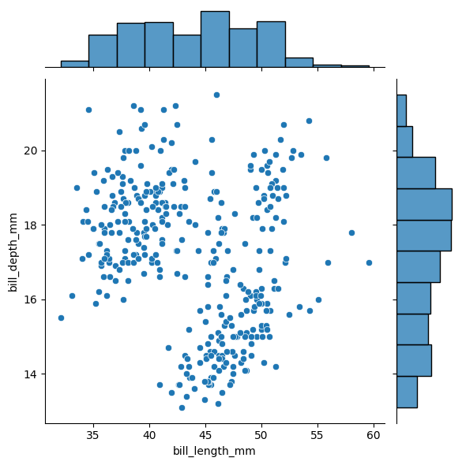

# Week 3: Data Viz
## Objectives 
- Plotting and displaying data in python
- Using numpy, pandas and seaborn libraries
  
## Downloads  
First things first! Download these palmer penguins data into your working directory. Note, you may need to use pip3. 
Into a terminal, type in: 
```
pip -q install palmerpenguins
```

### Installing and importing libraries 

Make sure you have these installed too. 
```
pip install numpy
pip install pandas
pip install seaborn
```

## Setting up
Start a new notebook. Save the file as "yourname_week3.ipynb". 
As before, copy the code into your notebook as chunks. 

Then, run an interactive python session in a terminal. In your python session:
```
import numpy as np
import pandas as pd
import seaborn as sns
import matplotlib.pyplot as plt
```
- Pandas is a library for working with tabular data. Based on the R data.frame library.
- Seaborn is a visulization package. 

### Importing data 
```
from palmerpenguins import load_penguins
df = load_penguins()
print(type(df))
df
```
### Summary statistics and properties 
```
df.describe()
df.dtypes
df.columns
```
### Indexing/accessing data in a data frame 
```
df.values
i=1
j=0
df.loc[i] 
df.iloc[i,j]
df[['bill_length_mm','island']]
df.query("year > 2007")

```

### Plotting 
```
sns.histplot(df['bill_length_mm'],kde=True,bins=20)
```

```
sns.jointplot(data=df, x="bill_length_mm", y="bill_depth_mm") 
```

```
sns.pairplot(df)
```

```
g = sns.boxplot(x = 'island',
            y ='body_mass_g',
            hue = 'species',
            data = penguins,
            palette=['#FF8C00','#159090','#A034F0'],
            linewidth=0.3)
g.set_xlabel('Island')
g.set_ylabel('Body Mass')
plt.show() 
```


```
g = sns.lmplot(x="flipper_length_mm",
               y="body_mass_g",
               hue="species",
               height=7,
               data=penguins,
               palette=['#FF8C00','#159090','#A034F0'])
g.set_xlabels('Flipper Length')
g.set_ylabels('Body Mass')
plt.show() 
```


- Multiple figures
- Use subplots() to create multiple figures.
```
import matplotlib.pyplot as pltt
fig ,ax = pltt.subplots(figsize=(15,12), ncols=2,nrows=2)
sns.swarmplot(data=df,x='species',y='body_mass_g',ax=ax[0,0],hue='species')
sns.violinplot(data=df,x='species',y='body_mass_g',ax=ax[0,1])
sns.boxplot(data=df,x='species',y='body_mass_g',ax=ax[1,0])
sns.barplot(data=df,x='species',y='body_mass_g',ax=ax[1,1])
pltt.show()
```


See the documentation at https://pandas.pydata.org/docs/user_guide/io.html


### Show the help message for this function.
```
df.to_csv?
```     

### Save to a file, load from file 
```
df.to_csv("mytaxis.csv")
df = pd.read_csv("mytaxis.csv")
df.head()
```    

### Colors etc
```
df["color"].value_counts()
df.groupby("color")["tip"].mean()
df.groupby("color").agg({"tip": "mean"})    
df.groupby("color")["tip"].describe()
```


## Test yourself!
1. Open a Juptyr notebook and save your work there.
2. Load the iris dataset. HINT: it is in the seaborn package. `iris = ???.load_dataset("iris")`.
3. Look at it and make a distribution plot for one of the variables. 
4. Do a pairplot between all variables for the iris dataset.
5. Plot a variable in the iris dataset with the four different plot types above. 

Solutions: Next week!

Back to the [homepage](../README.md)


