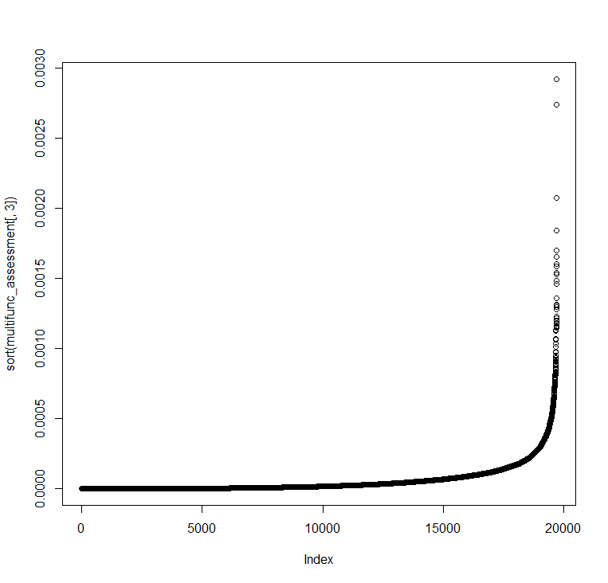
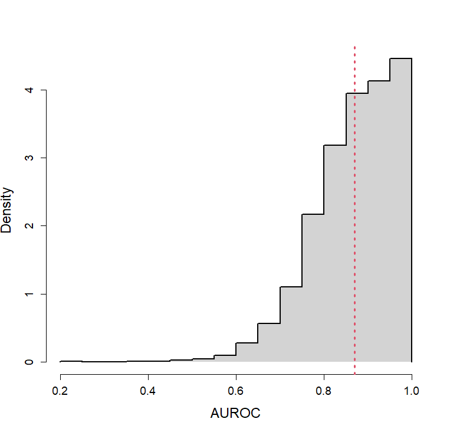
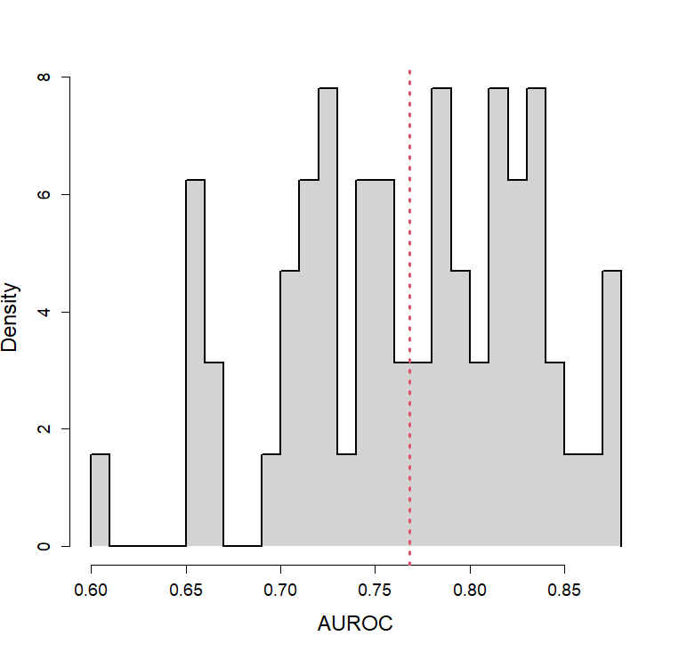
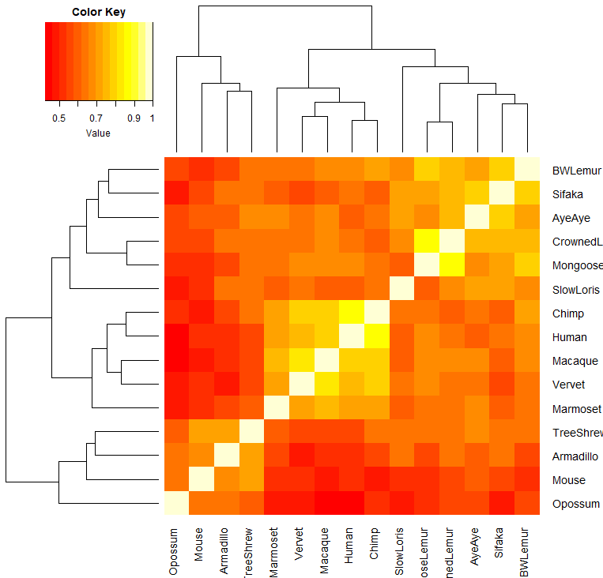

# Week 10: Recap
## Objectives 
- Recap and revision of what you've learnt this term
- Reproducing analyses in either R or Python

## Gene set enrichment 
Let's do some analyses. 

Download these files into your working directory: 
- [data](../data/recap.Rdata) 
- [helper.R](../data/helper.R)

Run this to install/load libraries
```
source("helper.R") 
load("recap.Rdata")
```

### Gene set enrichment (GSE) in R 
A method to identify properties of genes or proteins that are over-represented. GSE is a (relatively) straightforward method to sumamrize the results of your experiment, in particualr when you believe there is some link or association to a known phenotype (e.g., enrichment for dopamine receptors in Parkinson's disease). Uses statistical approaches to identify significantly enriched groups of genes, and the main annotation database is the Gene Ontology ([GO](http://www.geneontology.org/)) and the Molecular Signatures database ([MSigDB](http://software.broadinstitute.org/gsea/msigdb/index.jsp)). 
- The most well known method is GSEA: http://www.pnas.org/content/102/43/15545.short, but it can be a little complicated to run on other data (mostly for gene expression experiments) and interpret (old dispute here https://www.ncbi.nlm.nih.gov/pubmed/20048385). 
- There have been many others, and the simplest is a hypergeometric test to measure overlap. 

- One such method in R is enrichR: 
https://cran.r-project.org/web/packages/enrichR/vignettes/enrichR.html 

```
install.packages("enrichR")
library(enrichR)
dbs <- listEnrichrDbs()
dbs <- c("GO_Molecular_Function_2015", "GO_Cellular_Component_2015", "GO_Biological_Process_2015")
enriched <- enrichr(c("Runx1", "Gfi1", "Gfi1b", "Spi1", "Gata1", "Kdr"), dbs)
```
- Or, we can build a gene by function matrix and perform our own gene set enrichment (function is in helper.R) 
```
library(EGAD)
gene2term = (GO.mouse[,c(1,3)][GO.mouse[,4]!="IEA",] )
genesmouse = unique(GO.mouse[,1])
termsmouse = unique(GO.mouse[,3])  
annot = EGAD::make_annotations( gene2term, genesmouse, termsmouse )    
enriched2 <- gene_set_enrichment(c("Runx1", "Gfi1", "Gfi1b", "Spi1", "Gata1", "Kdr"), annot, GO.voc)
```
- How do the results compare?

### Multifunctionality 
- One worry we might have with GSE is gene multifunctionality (genes having many functions).  
- Multifunctional genes will return many functions in an enrichment assessment (not very useful!).   
- We can assess our results and genes by calculating how multifunctional genes and gene sets/functions are using the EGAD package 
```
multifunc_assessment <- calculate_multifunc(annot)
plot(sort(multifunc_assessment[,3]))
```




```
auc_mf <- auc_multifunc(annot, multifunc_assessment[,4])
names(auc_mf) = colnames(annot)
hist <- plot_distribution(auc_mf, xlab="AUROC", med=FALSE, avg=FALSE)
abline( v=mean(auc_mf, na.rm=T), col=2, lwd=3, lty=3)
```




- How multifunctional are our results? 
```
m = match( enriched2[enriched2$padj <= 0.05, 1], names(auc_mf))
hist <- plot_distribution(auc_mf[m], xlab="AUROC", med=FALSE, avg=FALSE)
abline( v=mean(auc_mf[m], na.rm=T), col=2, lwd=3, lty=3)
```




Hopefully, you can see that the averages are a little different. We can test if this is significant through a couple of ways. 
Permutation test: 
```
perm_r = sapply(1:10000, function(i) (mean(sample(auc_mf, length(m)), na.rm=T) ) )
sum(mean(auc_mf[m], na.rm=T) > perm_r )/ 10000
```
(should be ~0)


Wilcoxon test 
```
nm = match( enriched2[enriched2$padj > 0.05, 1], names(auc_mf))
wilcox.test( auc_mf[m], auc_mf[nm]) 
```
P-value should be < 2.2e-16

Both very significant! 


## Replicating a figure in R
Let's take a look at this paper:  https://genome.cshlp.org/content/22/4/602
- They've made their data available: https://genome.cshlp.org/content/suppl/2012/01/03/gr.130468.111.DC1/Supplemental.Database.primateRNAseq.zip    
- Let's try reproducing the heatmap (Supplementary figure 5).  https://genome.cshlp.org/content/suppl/2012/01/03/gr.130468.111.DC1/SupplementalFigures_08_09_11.pdf 

1. Get data 
(Note, if the data fails to download through R, click directly on the link and it should automatically do so. Remember to then copy over the zip file to your working directory!) 
```
download.file(url="https://genome.cshlp.org/content/suppl/2012/01/03/gr.130468.111.DC1/Supplemental.Database.primateRNAseq.zip", destfile="Supplemental.Database.primateRNAseq.zip")
unzip("Supplemental.Database.primateRNAseq.zip", files = NULL, list = FALSE, overwrite = TRUE, junkpaths = FALSE, exdir = "primateRNAseq", unzip = "internal", setTimes = FALSE)
unzip("primateRNAseq/Gene.expression.data.zip", files = NULL, list = FALSE, overwrite = TRUE, junkpaths = FALSE, exdir = "primateRNAseq/", unzip = "internal", setTimes = FALSE)
gene_expression_file = "primateRNAseq/Gene.expression.data/Normalized.expression.data.txt" 
exprs = read.table(gene_expression_file, header=T, row.names=1) 
samples = matrix(unlist(strsplit(colnames(exprs)[33:94] , "_" ) ) , byrow=T, ncol=2)
```


2. Clean up data
Just a note, the gene expression table contains additional data such as GC% and gene length, so we filter those columns out and use only the gene expression values (those are in columns 33 to 94). So we copy those over into another variable.
```
exprs.means = t(sapply(1:dim(exprs)[1], function(i) tapply(  as.numeric(exprs[i,33:94]), samples[,1], mean, na.rm=T) ))
samples.sub = names(tapply(  as.numeric(exprs[1,33:94]), samples[,1], mean, na.rm=T)) 
colnames(exprs.means) = samples.sub
rownames(exprs.means) = rownames(exprs)
```

3. Data analysis 
- Which species does not have enough data?
```
dim(exprs.means) 
colSums(is.na(exprs.means ))
```
In total, we have around 10K genes, but one of the species has no data for almost 8K genes. We drop that species.  
```
filt.species = which.max(colSums(is.na(exprs.means )))
```

Although a little arbitrary, we then select genes that are present in at least 6 species (this is also from their paper I believe), ignoring the species with little to no data. 
```
gene.subset  = rowSums(is.na(exprs.means[,-filt.species ] )  ) >5  
```


4. Plot/graph 
(Note heatmap.3 is in the helper.R file, make sure you have sourced it at the start!)
```
samples.cor = cor(exprs.means[ ,-filt.species], m="s", use="p")
heatmap.3(samples.cor)
``` 


```
samples.cor = cor(exprs.means[gene.subset,-filt.species ], m="s", use="p")
heatmap.3(samples.cor)
```




5. See if you can do the same in Python... 


Back to the [homepage](../README.md)
